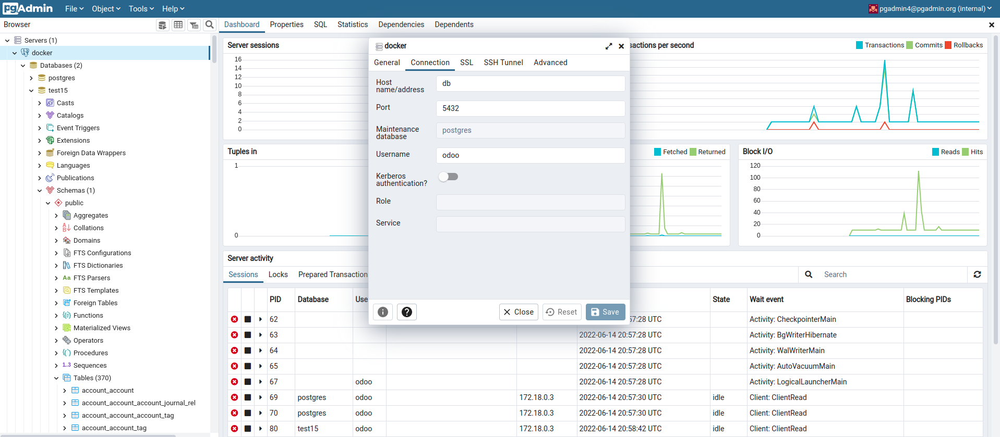
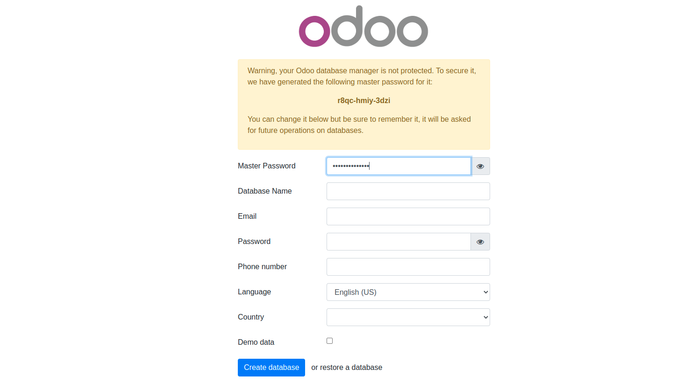
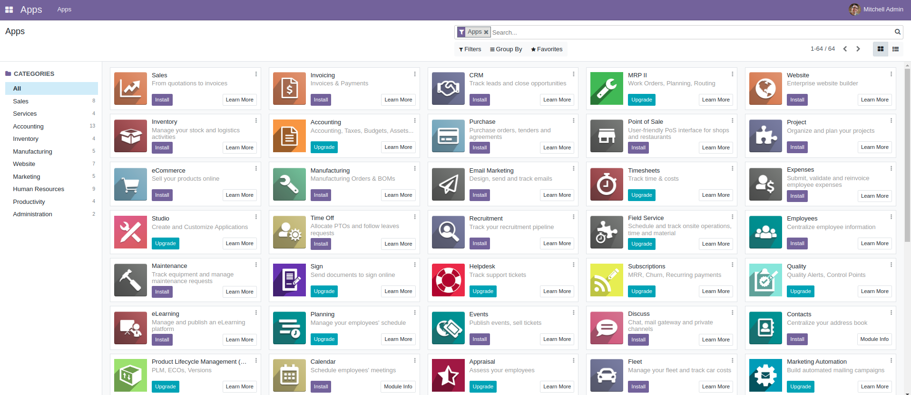
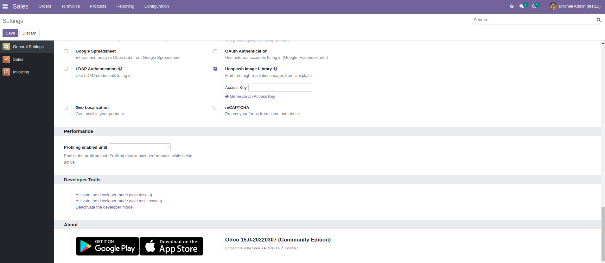
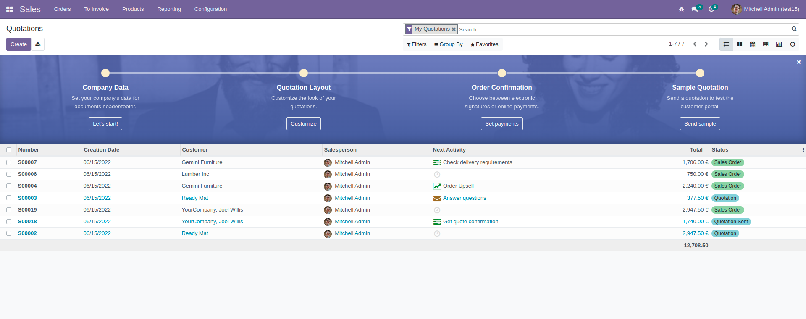

# Odoo 15 docker usage 

Clone this repo with related branch and switch to 15.0 branch. Change the folder permission to make sure that the container is able to access the directory:
```
git clone --single-branch --branch 15.0 <this repo's URL> odoo15
sudo chmod -R 777 odoo15/addons
sudo chmod -R 777 odoo15/etc
cd odoo15
```
Now you're in folder **odoo15**. Let's start the container:
```bash
docker-compose -f docker-compose.yml --env-file ./env/example.env -p odoo up
```

* Then open `localhost:8080` to access Odoo 15.0. If you want to start the server with a different port, change **ODOO_PORT** in env/example.env to another value, or create your's copy:

```
ports:
 - "8080:8069"
```

* Log file is printed @ **etc/odoo-server.log**

To run in detached mode, execute this command:

```bash
docker-compose -f docker-compose.yml --env-file ./env/example.env -p odoo up -d --remove-orphans
```

To stop and remove all containers (volumes will remain):

```
docker-compose -f docker-compose.yml --env-file ./env/example.env -p odoo down
```

# Custom addons

The **addons** folder contains custom addons. Just put your custom addons if you have any.

# Odoo configuration

To change Odoo configuration, edit file: **etc/odoo.conf**.

Configuration sample: [www.odoo.com/deploy.html](https://www.odoo.com/documentation/15.0/administration/install/deploy.html#id5)

# Access to PgAdmin:

You can use PgAdmin if you need. It's on port 5050 (127.0.0.1:5050 for example) and default credentials are:

* email: pgadmin4@pgadmin.org
* password: admin

If you don't need PgAdmin, you can comment it out or delete in docker-compose.yml.

# Add a new server in PgAdmin:

* Host name/address: db
* Port: 5432
* Username as POSTGRES_USER: odoo
* Password as POSTGRES_PASSWORD: odoo



# docker-compose.yml

* odoo:15
* postgres:13
* pgadmin4

# Odoo 15 screenshots








